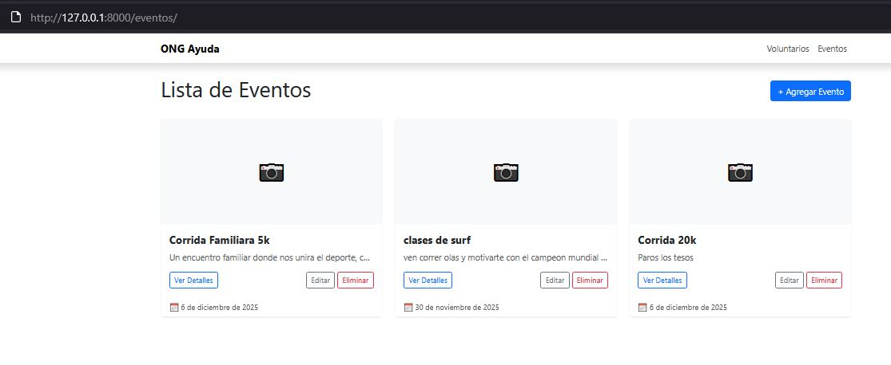

# 🤝 Plataforma de Gestión de Voluntariado ONG

Este proyecto es una aplicación web desarrollada en **Django** diseñada para una ONG que realiza eventos deportivos. Permite gestionar una base de datos de voluntarios, organizar eventos y asignar participantes a actividades específicas.

El sistema implementa un **CRUD completo** (Crear, Leer, Actualizar y Eliminar) y cuenta con mejoras visuales y funcionales como galerías de imágenes y un diseño personalizado.

---

## 🚀 Características Principales

### 1. Gestión de Datos (CRUD)
* **Voluntarios:** Registro completo con validaciones (Email único, teléfono).
* **Eventos:** Creación y edición de eventos con descripción y fechas.
* **Asignación:** Relación "Muchos a Muchos" (`ManyToManyField`) que permite vincular múltiples voluntarios a distintos eventos.

### 2. Galería de Imágenes (Mejora Técnica)
Implementación utilizando **Pillow**:
* **Fotos por Evento:** Posibilidad de subir múltiples imágenes a cada evento desde el panel de administración (`Inline Admin`).
* **Optimización:** Conversión automática de formatos a `.jpg` al subir imágenes.
* **Visualización:** Vista de tarjetas ("Cards") en el listado de eventos con imagen de portada.

### 3. Diseño e Interfaz
Personalización visual sobre Bootstrap 5:
* **Tema Visual:** Paleta de colores personalizada (Azul Profesional para navegación, Magenta para acciones y Gris Claro para fondos).
* **Responsive:** Diseño adaptable a dispositivos móviles.
* **Feedback:** Mensajes de alerta y confirmación de eliminación.

---

## 🛠️ Tecnologías Utilizadas

* **Lenguaje:** Python 3.12
* **Framework:** Django 5.2.8
* **Base de Datos:** SQLite3
* **Frontend:** HTML5, CSS3, Bootstrap 5.3
* **Librerías Extra:** `Pillow` (Procesamiento de Imágenes)

---

## 📝 Informe de Desarrollo

A continuación se detallan los pasos realizados para la construcción del sistema:

### 1. Inicio del Proyecto
Se inicializó el proyecto `ONG` y la aplicación `voluntariado`, que actúa como el núcleo del sistema de gestión.

### 2. Modelado de Datos
Se definieron los modelos en `models.py`:
* **`Voluntario`:** Almacena datos personales y fecha de registro.
* **`Evento`:** Almacena detalles de la actividad.
* **`FotoEvento`:** Modelo adicional para gestionar la galería de imágenes vinculada a los eventos.

### 3. Panel de Administración
Se configuró `admin.py` para gestionar los datos. Se implementó `FotoEventoInline` para permitir la carga de imágenes directamente dentro de la ficha de edición del evento.

### 4. Formularios
Se utilizaron `ModelForm` en `forms.py` para generar formularios automáticos, integrando selectores de fecha (`DateInput`) y checkboxes para la asignación de voluntarios.

### 5. Vistas y Controladores
En `views.py` se implementó la lógica para todas las operaciones CRUD, incluyendo la validación de formularios y el manejo de subida de archivos multimedia.

### 6. Seguridad
* **CSRF:** Protección en todos los formularios mediante ``.
* **Validación:** Control de integridad de datos en modelos y formularios.

## 📍 Mapa de Rutas (Endpoints)

La aplicación cuenta con las siguientes rutas de acceso para gestionar el contenido:

### Voluntarios
* **Listar:** `/voluntarios/` - Ver todos los registros.
* **Detalle:** `/voluntarios/<id>/` - Ver ficha completa.
* **Crear:** `/voluntarios/crear/` - Registrar nuevo voluntario.
* **Editar:** `/voluntarios/editar/<id>/` - Modificar datos.
* **Eliminar:** `/voluntarios/eliminar/<id>/` - Borrar registro.

### Eventos
* **Listar:** `/eventos/` - Ver tarjetas de eventos con fotos.
* **Detalle:** `/eventos/<id>/` - Ver información y galería.
* **Crear:** `/eventos/crear/` - Agendar nuevo evento.
* **Editar:** `/eventos/editar/<id>/` - Modificar evento.
* **Eliminar:** `/eventos/eliminar/<id>/` - Cancelar evento.

---