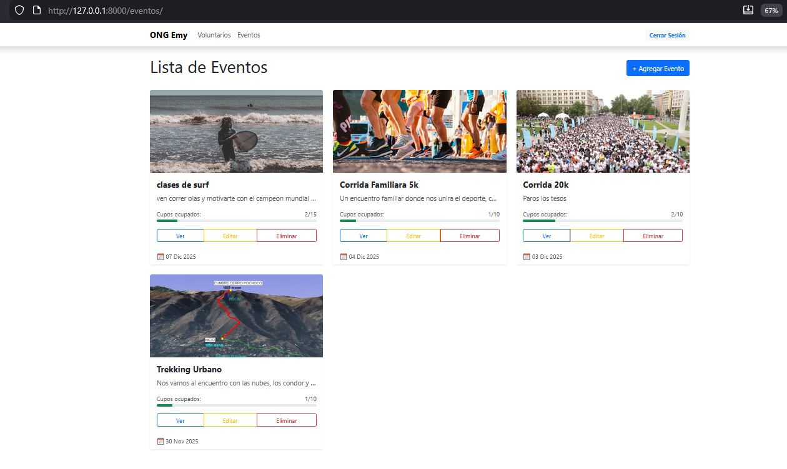
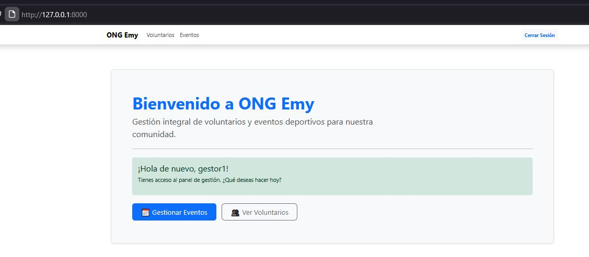

# 🤝 Plataforma de Gestión de Voluntariado ONG

Este proyecto es una aplicación web desarrollada en **Django** diseñada para una ONG que realiza eventos deportivos. Permite gestionar una base de datos de voluntarios, organizar eventos, controlar aforos y asignar participantes de manera eficiente.

El sistema implementa un **CRUD completo** y cuenta con un sistema de **Roles y Permisos (ACL)**, mejoras de seguridad y una interfaz gráfica optimizada con Bootstrap 5.

---

---

## 🚀 Nuevas Características (Refactorización M8)

### 1. Gestión Avanzada de Eventos y Aforo
* **Control de Capacidad:** Nuevo campo `aforo` en los eventos.
* **Visualización en Tiempo Real:** Barra de progreso dinámica que muestra el porcentaje de ocupación (verde/roja según disponibilidad).
* **Galería Integrada:** Soporte para subir fotos de portada directamente desde el formulario de creación/edición.

### 2. Seguridad y Control de Acceso (ACL)
Implementación robusta de permisos basada en roles de usuario:
* **Administrador:** Acceso total (Crear, Editar, Eliminar eventos y voluntarios).
* **Gestor:** Acceso limitado a la gestión operativa (Crear y Editar, pero **sin permiso de eliminar**).
* **Voluntario/Visitante:** Acceso de solo lectura o restringido.
* **Protección de Vistas:** Uso de decoradores `@permission_required` y `@login_required` para blindar las URLs.
* **Interfaz Condicional:** Los botones de "Editar" o "Eliminar" se ocultan automáticamente si el usuario no tiene permisos.

### 3. Refactorización de Código (Buenas Prácticas)
Se optimizó el código fuente para mejorar la mantenibilidad y robustez:
* **Transacciones Atómicas:** Uso de `transaction.atomic()` en las vistas para asegurar la integridad de la base de datos al guardar eventos y fotos simultáneamente.
* **Feedback al Usuario:** Implementación del framework de `messages` para alertas de éxito o error (Toasts/Alerts).
* **Manejo de Errores:** Uso de `get_object_or_404` para prevenir errores de servidor (500).
* **Widgets en Formularios:** Centralización de estilos CSS en `forms.py`, limpiando el código HTML de los templates.

---

## 🛠️ Tecnologías Utilizadas

* **Lenguaje:** Python 3.12
* **Framework:** Django 5.2.8
* **Base de Datos:** SQLite3
* **Frontend:** HTML5, CSS3, Bootstrap 5.3
* **Gestión de Archivos:** Pillow (Imágenes de perfil y portadas)
* **Control de Versiones:** Git & GitHub

---

## 📝 Informe de Desarrollo y Mejoras

### 1. Modelado de Datos (Actualizado)
* **`Voluntario`:** Se agregó campo `foto` para perfil e identificación visual en listas.
* **`Evento`:** Se agregó campo `aforo` (Integer) y validación de fechas.
* **`FotoEvento`:** Modelo relacional para manejo de galería.

### 2. Interfaz de Usuario (UI/UX)
* **Listas Inteligentes:** Se reemplazaron las listas básicas por tablas responsivas y tarjetas ("Cards") con imágenes.
* **Formularios Amigables:**
    * Implementación de **cajas con scroll** para la selección de voluntarios (evita listas infinitas).
    * Áreas de clic ampliadas para selección múltiple.
* **Navbar Dinámica:** Muestra opciones de "Iniciar Sesión" o "Cerrar Sesión" (con nombre de usuario) según el estado de autenticación.

### 3. Panel de Administración
* Configuración de grupos **"Gestores"** y **"Administradores"** con permisos granulares desde el `/admin` de Django.

## 📍 Mapa de Rutas (Endpoints Principales)

| Módulo | Acción | Ruta | Permiso Requerido |
| :--- | :--- | :--- | :--- |
| **Auth** | Login | `/login/` | Público |
| **Auth** | Registro | `/registro/` | Público |
| **Eventos** | Listar | `/eventos/` | Público |
| **Eventos** | Crear | `/eventos/crear/` | `add_evento` (Gestor/Admin) |
| **Eventos** | Editar | `/eventos/editar/<id>/` | `change_evento` (Gestor/Admin) |
| **Eventos** | Eliminar | `/eventos/eliminar/<id>/` |